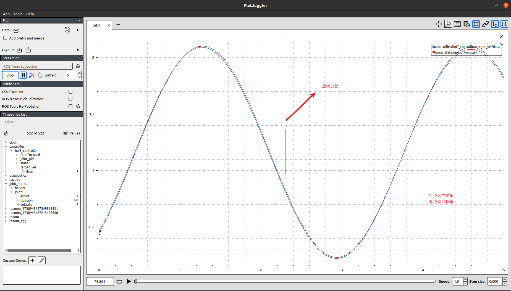

# 学习心得

## task1

学到了如何编写URDF

学会了使用xacro更好地编写URDF

了解了ros_control是如何和gazebo进行交互的

学会了移植ros官方插件控制器

学习了代码规范

### URDF编写

urdf就是用于仿真中描述机器人物理特性及外观特性的一种XML 格式文件


### 控制器使用

采用了ros_control官方的差速底盘控制器

http://wiki.ros.org/diff_drive_controller


小车自转运动有些问题，初步排查认为是参数设置不合理导致。

### Gazebo和URDF的联系

通过ros官方提供的包gazebo_ros，可以联系起两者，调用spawn_model即可生成模型在Gazebo中。

### 获得URDF参数

若要获得urdf的参数，可参考下面代码

```c++

const std::string model_param_name = "robot_description";
    bool res = root_nh.hasParam(model_param_name);
    std::string robot_model_str="";
    if (!res || !root_nh.getParam(model_param_name,robot_model_str))
    {
      ROS_ERROR_NAMED(name_, "Robot description couldn't be retrieved from param server.");
      return false;
    }

    urdf::ModelInterfaceSharedPtr model(urdf::parseURDF(robot_model_str));

    urdf::JointConstSharedPtr left_wheel_joint(model->getJoint(left_wheel_name));
    urdf::JointConstSharedPtr right_wheel_joint(model->getJoint(right_wheel_name));
```

### Usage

```
mon launch learn_description load_description.launch
mon launch chassis_controller load_controller.launch
```

向/controller/diff_drive_controller/cmd_vel话题发送消息可操控小车运动。

若要使用键盘控制

```
roslaunch chassis_controller teleop_twist_keyboard
```

## task2

### 前馈PID

#### 引言

传统PID的控制是以当前状态下的误差作出调整输出，也就是传统的反馈控制流程。这样会导致一个问题，输出控制的反应总是会有一个延时，从而导致控制过程，控制量会比目标量慢一步达到。因此就需要引出前馈控制环节了。

#### 前馈

前馈：顾名思义-前向反馈。也就是在控制输入环节前，不通过输出的值影响输入。而是直接影响输入。也就是通过预测下一时刻可能的目标量，对输入进行影响。通常预测下一时刻可能的目标量都是通过理论模型得到的。


### 仿真

分别执行以下命令，启动仿真

```bash
roscore
# 加载gazebo和机器人URDF
mon launch learn_description load_buff_description.launch
# 加载控制器
mon launch buff_controller load_controller.launch
```


#### 仿真下的前馈PID调试



未加入前馈时，可以看到控制的输出反馈到实际上需要时间，有延时。


加入前馈，并调整至合适的前馈系数后，可以看到轨迹更加贴合，滞后性缓解。


### rm_hardware

#### can

在使用前需要先安装can-utils

```
sudo apt install can-utils
```

链接上usb2can后，初始化can总线

```bash
sudo ip link set can0 up type can bitrate 1000000   #设置can0波特率  can0和can1都需要初始化
candump can0                              #打开另一个终端，接受can0数据
```

如果能收到数据，就说明can总线没问题

#### rm_hw_config

下面是`buff_hw_config.yaml`文件


配置好后，执行下列命令

```bash
roscore
# 加载硬件层和机器人URDF
mon launch learn_hardware buff_hw.launch
# 加载控制器
mon launch buff_controller load_controller.launch
```

静止放置时，2006电机接收到的实际数据。可以看到杂波很多，这时可以调节低通滤波器的截止频率，即`buff_hw_config.yaml`文件中的lp_cutoff_frequency参数。一般是高频噪声较多，将截止频率调低即可，但也不能太低。


调整好合适的PID参数后，电机对单一目标速度的跟随


未加入前馈的PID实物电机跟随


加入前馈，并调整合适的前馈系数后


可以看到滞后性得到缓解。


最终得到的实际用于实物的前馈PID全部参数


### 使用

启动控制器后，对话题/controllers/buff_controller/state

- 发送1开启大符转动模式
- 发送2开启小符转动模式
- 发送3停止转动。

### PID经验

- 速度控制，常用PI控制，用于快速达到目标速度

- 位置控制，常用PD控制，用于稳定达到目标位置

  P：比例	I：积分	D：微分

  大多数PID控制都必须要有P，用于实现达到目标

  I的存在常用于消除稳态误差

  D则是阻尼，加入D，可以使得系统**稳定地**到达目标值，但同时也会使得系统响应变慢。同时会使系统对外界轻微输入产生较大的响应。
